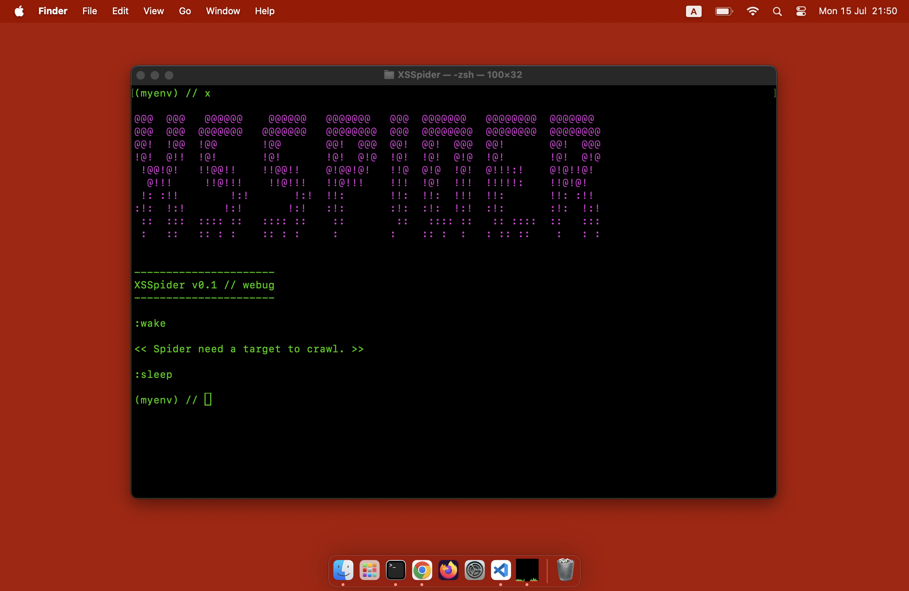

# XSSpider version 0.1

There was a little spider named Spikey who loved exploring the vast world of the internet. One day, Spikey discovered a passion for finding security vulnerabilities known as XSS (Cross-Site Scripting). Spikey would often crawl through various web pages, observing and seeking out weak points where code could be injected. Spikey didn't do this to harm or destroy, but to learn and help alert website owners to improve their security. With a love for adventure and a good heart, Spikey became a silent guardian of the cyber world, quietly protecting internet users from XSS attacks without anyone ever knowing.

This repository is inspired by XSStrike.

## Thank you

https://github.com/s0md3v/XSStrike

Licensed under the GNU GPLv3, see [LICENSE](LICENSE) for more information.

